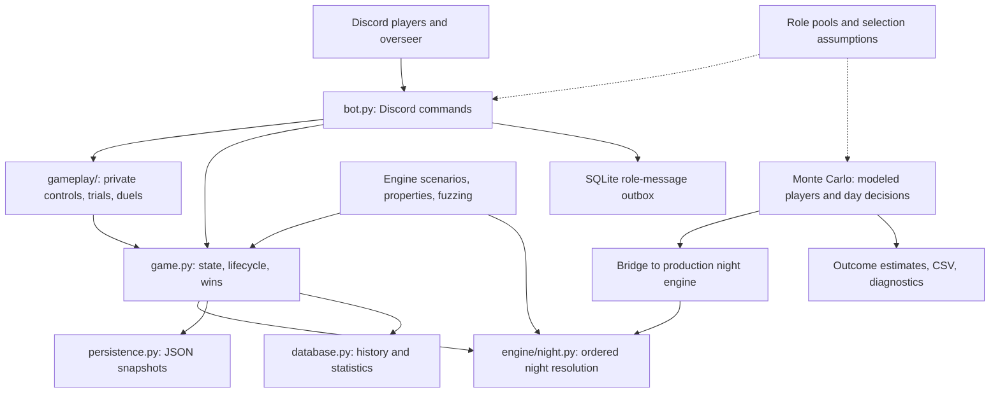
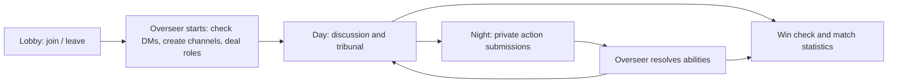
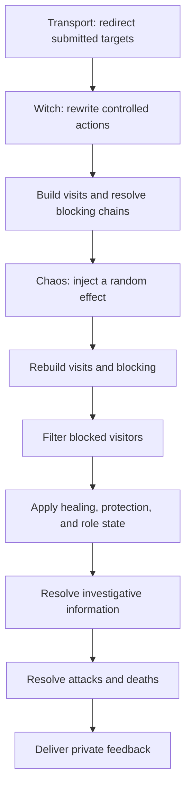

# MafiaBot

**A Discord social-deduction game with 32 roles, an ordered night-resolution engine, persistent match history, restart recovery, and a Monte Carlo balance-analysis system.**

MafiaBot hosts a Mafia/Town-of-Salem-inspired ruleset for a Discord server. Players receive hidden roles, submit private night actions, and discuss their suspicions during the day. An overseer runs the game while the bot handles role interactions, nominations and trials, deaths, faction outcomes, and personal objectives.

The repository includes the playable Discord bot and its rules engine, an engine-backed model for repeated-game balance experiments, and regression, property-testing, fuzzing, replay, and minimization tools. The implementation was developed with AI assistance under the author's direction and review.

**Python · discord.py · asyncio · SQLite · Monte Carlo simulation · Hypothesis**

[Player and role guide](MAFIA_GAME_GUIDE.md) · [Simulation and testing guide](docs/SIMULATION.md) · [License](LICENSE)

## Contents

- [Architecture](#architecture)
- [Role roster and lobby generation](#role-roster-and-lobby-generation)
- [Game lifecycle and player controls](#game-lifecycle-and-player-controls)
- [Night-resolution engine](#night-resolution-engine)
- [Tribunal and Pirate duels](#tribunal-and-pirate-duels)
- [Monte Carlo balance analysis](#monte-carlo-balance-analysis)
- [Regression testing and failure reproduction](#regression-testing-and-failure-reproduction)
- [Persistence, recovery, and delivery](#persistence-recovery-and-delivery)
- [Player statistics and leaderboards](#player-statistics-and-leaderboards)
- [Run on your server](#run-on-your-server)
- [Source layout](#source-layout)

## Architecture

The Discord command layer translates player input into game state and submitted actions. `Game` owns the roster, stable seat numbers, phases, role resources, death handling, and win conditions. The night engine resolves interacting abilities in a defined order. JSON snapshots retain active-game state; SQLite stores match history, aggregate statistics, and queued role messages.



Two verification paths serve different purposes. The engine harness exercises game components with Discord test doubles and checks specific behavior. The Monte Carlo simulator samples modeled player decisions and uses the production night pipeline through a headless bridge. Lobby generation and several win/death helpers are shared too. Daytime behavior and player decisions still contain separate assumptions; sharing the night engine does not make the simulated matches equivalent to human play.

## Role roster and lobby generation

The configured roster contains **15 Town, 8 Mafia, and 9 neutral roles**. Commands below use stable seat numbers assigned at game start; seats remain unchanged when players die. Full rules, targeting restrictions, and strategy notes are in the [player guide](MAFIA_GAME_GUIDE.md).

### Town

- **Retributionist** — `!corpses`, `!reanimate`: use an eligible dead Town player's ability. One use through seven players, two above seven; a corpse can be used once, and hidden corpses are unavailable. A Transporter corpse requires two targets.
- **Doctor** — `!heal`: protect a player, with one self-heal per game. A revealed Mayor cannot be healed.
- **Sheriff** — `!investigate`: receive an innocent/suspicious result. Framing and dousing can make a target appear suspicious.
- **Investigator** — `!investigate`: receive a bucket of possible roles rather than a single exact identity.
- **Lookout** — `!watch`: inspect visits to a chosen player.
- **Tracker** — `!track`: inspect where a chosen player visited.
- **Escort** — `!roleblock`: prevent a target's night action, subject to immunity and interaction rules.
- **Vigilante** — `!shoot`: one bullet. Killing a Town member triggers delayed guilt.
- **Bodyguard** — `!protect`: one off-self protection and one self-protection. A successful interception can kill the attacker and the Bodyguard.
- **Scary Grandma** — `!alert`: one alert through seven players, two above seven, attacking visitors while on guard.
- **Transporter** — `!transport`: swap two players' destinations, changing where other abilities land.
- **Mayor** — `!reveal`: publicly reveal during the day to receive double vote weight.

- **Psychic** — passive visions after resolution: odd nights name three slots containing an evil player; even nights name two qualifying good players. Blocking, small survivor counts, and Witch control affect delivery.
- **Deputy** — daytime `!shoot` from Day 2: one bullet per Deputy for the entire game. A mistaken shot kills the target and the Deputy.
- **Seer** — `!gaze`: compare two other players as Friends or Enemies using alignment buckets. Cannot repeat an unordered pair or gaze a revealed Mayor.

### Mafia

- **Mobster** — `!kill`: the Mafia's direct night attack.
- **Consort** — `!roleblock`: the Mafia's roleblocker.
- **Framer** — `!frame`: falsify investigative information on nights one and two.
- **Gravedigger** — `!hide`: one use to hide a target's role if they die.
- **Hypnotist** — `!hypnotize`: send fake healed, roleblocked, transported, controlled, or attacked feedback.
- **Mole** — `!investigate`: one exact-role investigation.
- **Tailor** — `!tailor`: one use to substitute a false role in a death reveal.
- **Gatekeeper** — `!guard`: one use through seven players, two above seven, to block non-Mafia visitors to a non-Mafia guarded house. Cannot self-guard or successfully guard the same effective target on consecutive nights.

### Neutral

- **Executioner** — get an assigned Town target lynched. A target killed at night can cause conversion to Jester.
- **Jester** — win by being lynched; afterward, `!haunt` an eligible guilty or abstaining voter.
- **Survivor** — survive to the end; `!vest` provides temporary defense, with one vest through seven players and two above seven.
- **Witch** — survive to see Town lose; `!control` forces one player's action toward another and reveals the controlled player's role.
- **Pirate** — `!plunder` initiates a private duel and blocks the target. Successful plunder contributes toward a personal objective.
- **Arsonist** — `!douse`, `!clean`, `!ignite`: build a doused-player set, remove gasoline from yourself, or ignite doused players through ordinary defenses.
- **Chaos** — survive to the end; one use through seven players, two above seven, of `!chaos` introduces a random non-killing effect involving two targets.

- **Guardian Angel** — assigned a bound player; `!ward` has one charge, clears their douse, grants invincible night protection, and prevents next-day nomination. A dead Guardian Angel can still ward astrally; personal victory requires surviving and qualifying under the shared win rules.
- **Serial Killer** — `!stab` gives a nightly basic attack; `!cautious` toggles retaliation against ordinary roleblockers. Has basic defense and roleblock immunity, with separate Pirate interactions.

### Size-dependent composition

Games require at least five players. The live start command and default simulator draw from the same [`game_roles.py`](game_roles.py) generator.

Five players receive one Town Investigative, one Town Protective, two Random Town slots, and one Mobster, with no neutral. Six players add one neutral; seven add two neutrals from distinct buckets. From eight players onward, the generator draws weighted Town and Mafia support pools: eight/nine have two Mafia and one neutral; ten through twelve have three Mafia and two neutrals; larger lobbies have four Mafia and two neutrals. Remaining slots are Town.

Repeated roles are allowed except Mayor, Scary Grandma, Retributionist, Mobster, Pirate, Arsonist, and Guardian Angel. Neutral slots select distinct benign/evil/killing/chaotic buckets, then a weighted role within each chosen bucket. The small-lobby manifests and larger flat pools are documented in [`game_roles_tos.py`](game_roles_tos.py) and `game_roles.py`.

## Game lifecycle and player controls



Players use `!join`, `!leave`, and `!players` to manage the lobby. `!startgame` checks DM access before beginning, prepares the server infrastructure, assigns roles and initial resources, persists the game, and queues role messages.

The overseer uses `!night`, `!resolve`, and `!day` to advance play. These controls check the current phase and guard against repeated resolution. A guilty tribunal can also start the next night after death processing and a win-condition check. The bot is intended for overseer-led games, rather than a fully unattended timer loop.

### Private actions and stable targeting

Night actions can be submitted through prefix commands in DMs or configured private player channels. Supported hybrid commands also offer slash-command target autocomplete in the server. Public-channel submissions are rejected to reduce accidental disclosure of hidden actions. Submitting another valid action replaces the previous selection before resolution.

`/actions` opens private Components V2 controls with role-specific abilities, paged targets, explicit submission, and optional corpse/message choices. Commands and components share validation and payload construction; stale panels cannot submit into a later phase.

Target autocomplete is built from living players and stable seat numbers. Commands validate such conditions as phase, living status, role ownership, target eligibility, and remaining charges. Restrictions differ by ability: a Doctor's self-heal is limited, a Framer acts only on early nights, and a Retributionist chooses from a numbered eligible-corpse list.

`!myrole` returns private role instructions. `!will` supports a last-will editor and a clear operation; death handling uses the stored will and the role-reveal state, including hidden or tailored identities.

### Discord infrastructure

The bot creates or reuses game text and voice channels and player roles. It applies Mafia and graveyard visibility, changes speaking permissions during phases and trials, and attempts to move dead players into the graveyard voice channel. Its role hierarchy and channel permissions therefore form part of installation and live-server validation.

## Night-resolution engine

[`engine/night.py`](engine/night.py) resolves abilities through an ordered pipeline. This order matters because one action can change the target, eligibility, information, or survival outcome of another.



### Redirection, visits, and blocking

Transport resolves before Witch control. Visit records are then built from the resulting actions. Witch visits the controlled player, while the controlled player's action determines their own destination. Transport actions and self-only abilities have specific handling rather than being treated as ordinary one-target visits.

Blocking is a dependency problem: a blocked roleblocker should not apply its block, and a blocked Gatekeeper should not maintain a guard. `_compute_blocked_sets` evaluates ordinary roleblocks and guarded-house effects together. It tracks repeated states and bounds its outer passes, avoiding an unbounded loop when interactions cycle.

The engine distinguishes raw visit records used during blocking from the effective records after blocked actors are removed. Lookout, Tracker, alert interactions, and later resolution consume the appropriate resulting state. Chaos can introduce a new roleblock, transport, guard, or information effect; visits and blocking are rebuilt afterward so subsequent stages see the changed actions.

### Protection, information, and combat

Miscellaneous actions establish healing/protection maps and role state before investigation and killing. This allows a frame or douse to affect investigative feedback, and a successful protection to affect the later attack outcome.

Sheriff and Investigator return different forms of information; Lookout and Tracker depend on effective visits; Mole returns an exact role. False information is represented through game mechanics, including frames, douses, fake Hypnotist messages, and tailored death identities.

Combat accounts for ordinary attacks, healing, temporary defense, Bodyguard interceptions, visitor attacks from Scary Grandma, and Arsonist ignition. Death causes and private feedback are tracked alongside survival: a Doctor can receive confirmation of an attempted save, and a failed attack can produce defensive feedback.

The command layer expands Retributionist corpse actions into the corresponding ability inputs before resolution. Limited-use abilities retain per-role state, while delayed effects such as Vigilante guilt and Executioner conversion continue into subsequent phases.

Faction victories and personal victories are recorded separately. A neutral objective can succeed without immediately ending the whole match; its success should not be interpreted as another mutually exclusive faction result.

## Tribunal and Pirate duels

### Daytime tribunal

The overseer starts a tribunal with `!vote`, with up to two trials per day. Components V2 controls collect nominations and judgments; changing a choice updates that player's saved ballot.

1. **Nomination — 300 seconds:** living players choose another eligible living player or abstain. A unique positive leader advances; a tie or no votes produces no defendant. Guardian Angel protection prevents nomination.
2. **Defense — 45 seconds:** the defendant receives the stand role, while voice permissions let the defendant speak.
3. **Judgment — 30 seconds:** eligible players select Guilty, Innocent, or Abstain. The defendant cannot judge their own case; a revealed Mayor's vote counts twice.
4. **Verdict:** the committed result proceeds to death handling and phase advancement. Guilty must exceed innocent; ties spare the defendant.

Votes, UTC deadlines, stage tokens, results, and completion receipts survive restarts. The controller reconstructs modern trial views, repairs voice permissions, and resumes pending delivery. Old snapshots without modern control records receive compatibility handling; this does not promise resumption of every historical UI state.

### Pirate duels

`!plunder` opens private selection controls with a 30-second timeout. Both choices, deadlines, tokens, prompts, and results are persisted. Restart recovery resumes modern duels; incomplete legacy actions without recoverable choices/deadlines are closed rather than invented. Resolution waits for unfinished duels. Winning the choice interaction and killing the target are distinct: other abilities can prevent the final kill, and Pirate's objective requires two effective plunder kills.

## Monte Carlo balance analysis

[`scripts/monte_carlo_sim.py`](scripts/monte_carlo_sim.py) is the CLI for a modular repeated-game model covering day/night cycles, role decisions, investigative evidence, attacks and defenses, resource use, and neutral objectives. It estimates how a configuration behaves under specified player assumptions, rather than ranking role names in isolation.

### Fixed compositions and reproducible sweeps

For a chosen role list, the simulator repeatedly samples decisions and outcomes. `--roles`, `--n`, and `--seed` control the composition, rollout count, and random seed. The default fixed-list run uses 20,000 rollouts; smaller counts are useful while checking an experiment's setup.

Five- and six-player enumeration explores supported small-lobby manifests and constraints. Counts depend on the selected generator and filters. `--n-per` controls rollouts per composition and defaults to 1,000; enumeration is a larger experiment than a small sampled batch.

Enumeration derives each composition's seed from the base seed and a BLAKE2b digest of its sorted role list. This makes a composition's seed stable across processes, rather than relying on Python's randomized string hash. The sweep produces a CSV with role lists, rollout counts, estimated generator frequency, and outcome rates.

### Generator weighting

Two compositions with similar strength can occur at very different frequencies under the live-style weighted generator. The enumeration report therefore calculates both a simple average across compositions and an average weighted by their estimated generation probabilities.

Generator frequencies are estimated in a separate roster-sampling pass rather than counted as extra simulated games. The report distinguishes pooled outcomes from averages across composition or worker chunks and includes the relevant denominators.

For larger-lobby experiments, `--generator-trials` repeatedly samples rosters and plays them through the model. `--generator-distribution` instead measures role appearance rates and common compositions without simulating gameplay. This separates selection-policy effects from decisions during a match.

### Player competence and evidence

The competence model has separate targeting, resource-usage, and daytime axes for each role. A lobby skill setting and role-specific difficulty determine the probability of taking a heuristic action instead of a legal random alternative. `--show-competence` exposes these assumptions; `--no-difficulty` chooses the heuristic branch at supported decision points. It does not turn the simulator into an optimal solver.

The day model accumulates investigative evidence and uses living Town competence when choosing a lynch. Night heuristics include role-dependent targeting and resource timing. These are explicit modeling assumptions, not measured estimates of how human players behave.

### Controlled comparisons and diagnostics

Experiments can require or exclude a role, override Mafia/neutral counts, constrain investigative roles, require a protective role, or change lobby skill. These controls help compare questions such as how outcomes shift when a lobby contains fewer investigative roles or when a particular neutral is present. Choose feasible combinations within the available role pools.

`--diagnostics` records modeled events such as mislynches, saves, blocks, and controls, as well as game duration. `--trace-one` provides an individual-game trace to inspect what happened behind an aggregate result. The `--audit` mode checks coverage against the configured role universe; the simulator's no-power Civilian is reserved for explicit experiments and is not a generated bot role.

### Example workflow

Run the role audit, inspect the generated distribution, then estimate outcomes under a recorded seed:

```powershell
python scripts/monte_carlo_sim.py --audit
python scripts/monte_carlo_sim.py --workers 2 --generator-trials 1000 --player-count 7 --seed 12345 --generator-distribution
python scripts/monte_carlo_sim.py --workers 2 --generator-trials 1000 --player-count 7 --seed 12345 --diagnostics
```

For a composition sweep:

```powershell
python scripts/monte_carlo_sim.py --enumerate 5 --n-per 100 --seed 12345 --out-csv scripts/monte_carlo_5p.csv
```

Generator trials support process parallelism through `--workers`; `--serial` or `--workers 1` provides a serial run. Workers are capped by trial count and aggregate seeded chunks; default sizing uses available CPU count. Use an explicit count for bounded local runs. Large enumerations take longer than a sampled experiment. Reports are generated locally and excluded from Git; this publication does not include historical result datasets or performance claims.

Results depend on the decisions and resolution rules in this separate model. Neutral successes can overlap with faction outcomes, and finite samples have sampling uncertainty. Use consistent assumptions and multiple seeds when comparing changes, then validate promising configurations through engine checks and human playtesting. Increasing trial count reduces sampling noise; it does not remove model mismatch.

## Regression testing and failure reproduction

The project uses several layers of checks, with different coverage and execution costs.

### Deterministic engine scenarios

[`scripts/sim_test.py`](scripts/sim_test.py) creates fake members, guilds, and channels, then invokes the game's night-resolution components and captures intermediate actions, visit records, blocks, protection maps, deaths, and private messages. Its deterministic scenarios assert particular interaction outcomes. [`scripts/ability_self_test.py`](scripts/ability_self_test.py) adds individual-ability checks.

The harness can explore randomized inputs and role-set enumeration, with additional systematic action coverage available through its options. These modes are useful for investigating interactions that a small set of hand-selected examples could miss. They exercise real game components, but the harness orchestration and Discord doubles are not a substitute for running the complete bot on a server.

### Properties and fuzzing

[`scripts/property_test.py`](scripts/property_test.py) uses Hypothesis-generated roles and actions, including malformed targets, to check runtime and post-night invariants. Other tools fuzz phase transitions, state serialization, member rehydration, persistence files, and tribunal behavior.

These checks ask whether state remains valid across a broad input space. A run surviving randomized actions is different evidence from a scenario proving the expected winner or investigative result; both forms are useful.

### Capture, replay, and minimization

[`scripts/bug_finder.py`](scripts/bug_finder.py) coordinates multiple checking lanes. Failures can be captured as reproducible fixtures, replayed by regression suites, and reduced by minimizers into smaller cases. This allows a randomized failure to become a targeted regression instead of relying on reproducing the same long run manually.

Retained replay fixtures are synthetic. Some replay collections are empty and appear as skipped parameter sets. Newly generated failures should be reviewed before publication because their state can include identifiers from their inputs.

### CI and validation scope

[Windows/Python 3.14.8 and 3.12 CI](.github/workflows/tests.yml) installs the dependency set in `constraints.txt` and runs the bounded pytest launcher, the standalone smoke suite, 200 seeded engine iterations, and the simulator role audit on pushes and pull requests. The October 6, 2026 gameplay and compatibility checks passed **451 pytest tests, with three skipped empty replay collections**, plus 47 engine scenarios with 200 seeded fuzz iterations and the 32-role audit on both Python versions. The earlier integration pass also exercised 50 generated matches with two workers and 10 fixed-lineup matches including all five restored roles. These are bounded checks, not every optional large experiment.

The five added roles now have [upgraded private controls](docs/MODERN_GAMEPLAY.md#controls-for-the-five-added-roles): Deputy day shots with a final Fire confirmation, explicit Serial Killer mode buttons, preselected Guardian Angel wards, and Seer/Psychic report cards with persistent private histories. Reopen these with `/actions` or `!actions`. Existing role rules and command syntax remain in place.

Regression coverage includes database/outbox behavior, restart recovery, private-channel guards, configuration validation, and specific role interactions. Larger fuzzing and property runs are available separately; consult each script's `--help` and the [simulation guide](docs/SIMULATION.md).

These checks use Discord test doubles. On October 6, 2026, the project owner waived the live-server test as a prerequisite for the Python 3.14 upgrade. A real Discord test remains available as an optional check; no live gateway test was performed.

## Persistence, recovery, and delivery

### Active-game snapshots

[`persistence.py`](persistence.py) stores JSON snapshots through a temporary file followed by replacement. Game serialization retains player identifiers, roles, resources, actions, phase state, and tribunal fields. On startup, the bot reconstructs member references and repairs game roles and private-channel access before reopening gameplay. Saved player IDs remain intact while recovery is pending. Temporary file-read or member-lookup failures defer recovery; only a confirmed missing member counts as a departure. Existing graveyard entries remain dead without applying their consequences twice.

A saved startup checkpoint resumes the original role assignment after interruption. Trial and night completion records retain unfinished announcements across later phases. Access cleanup and logical verdict application continue independently of public-message failures. Phase changes, ability-use accounting, tribunal verdicts, and endgame handling have guards against repeated execution. A persisted game key also prevents repeat match/stat submissions. These mechanisms address different duplicate paths; they are not a universal transaction across Discord and local storage.

### Queued role messages

The SQLite DM outbox stores target users, content, deduplication keys, match identity, status, attempts, and retry timing. Role-deal messages are queued after game state is saved. The pump claims pending batches, marks delivered messages, schedules retries, and recovers entries left in a stale sending state. SQLite operations run outside the event loop and always close their connections. Messages from a superseded match are discarded, including during restart before the saved match is fully loaded. In-flight private delivery is drained before a new match starts.

This queue covers role assignment and associated startup messages. Other private feedback uses direct sends. A crash between Discord delivery and the local acknowledgement can still lead to a repeated send, so the design does not promise exactly-once delivery.

### Connection handling

The bot includes a single-instance lock, gateway monitoring, reconnect handling, and command-sync controls. A watchdog restart drains pending work and recreates the HTTP session, connector, and loop bindings; it preserves the canonical game object for recovery. Running one process per installation avoids competing writers and duplicate command handling. A server operator still needs to supervise the process, preserve its runtime state, and verify the permissions required by the game.

## Player statistics and leaderboards

SQLite stores matches and participant records alongside aggregate and per-role statistics. Participant records preserve starting-role information even if a player is promoted or converted, while faction outcomes and personal wins are tracked separately.

`!stats` provides a player summary. `/leaderboard` opens selectable views for overall wins, faction wins, personal objectives, and win rate; the win-rate query applies a minimum-games threshold. The overseer can import legacy JSON statistics with `!importstats`. The default rejects any imported counter that would replace newer data, within the same SQLite transaction as the import. `!importstats force` explicitly permits an intentional replacement.

The database uses a unique durable game key to identify a committed match and avoid adding the same match twice. History supports aggregate analysis and player progress; this repository does not provide a complete action-by-action match replay interface.

## Run on your server

Use **standard 64-bit CPython 3.14.8**. The default launcher selects `.venv314`; Python 3.12 remains covered by CI and the existing `.venv` is preserved for rollback. Each installation is configured for one allowed guild. See the [runtime and rollout notes](docs/MODERN_GAMEPLAY.md).

```powershell
git clone https://github.com/chentaot1/mafiabot.git
cd mafiabot
py -3.14 -m venv .venv314
.\.venv314\Scripts\Activate.ps1
python -m pip install -c constraints.txt -r requirements.txt
Copy-Item .env.example .env
```

Configure your own values in `.env`:

- `DISCORD_TOKEN`: application bot token. `DISCORD_BOT_TOKEN` is accepted as an alias.
- `ALLOWED_GUILD_ID`: the server hosting the game.
- `PLAYING_ROLE_ID`: the existing role assigned to game participants.
- `GAME_OVERSEER_ROLE_ID`: the role authorized to run overseer controls.
- `GAME_CATEGORY_ID`: use `0` to let the bot find or create its game category.
- `PLAYER_PRIVATE_CHANNEL_IDS`: optional JSON mapping of player IDs to private channel IDs; `{}` uses DMs.

Server IDs are not built into the published configuration. Invalid or missing required settings are rejected before a live gateway session.

Enable **Server Members** and **Message Content** intents in the Discord application. Invite the bot with bot and application-command scopes. It needs permission to manage the game channels and roles, move members, send messages, add reactions, read message history, and use the relevant voice channels. Put its role above the roles it must manage. Players must allow DMs for the start check and private game feedback.

```powershell
.\scripts\run_bot.ps1 -Check
.\scripts\run_bot.ps1
```

Gather at least five players with `!join`, then use the configured overseer account to run `!startgame`, `!vote`, `!night`, `!resolve`, and `!day` as appropriate. Consult the [player guide](MAFIA_GAME_GUIDE.md) for complete role commands.

### Run the bounded checks

```powershell
python -m pip install -c constraints.txt -r requirements-dev.txt
python scripts/run_bounded_tests.py --isolated -ra
python smoke_test.py
python scripts/sim_test.py --skip-exhaustive --fuzz-iterations 200 --seed 12345
python scripts/monte_carlo_sim.py --audit
```

The `--isolated` regression profile disables dotenv loading, uses fake Discord settings and temporary state, and constructs commands without connecting to Discord. Standalone smoke and simulator commands above use their existing test doubles.

Tokens, live server state, databases, logs, and generated simulation reports are excluded from Git. Preserve your own runtime files when upgrading; do not commit them to a public fork.

## Source layout

- [`bot.py`](bot.py): Discord commands, weighted lobby generation, tribunals, duels, startup, and recovery.
- [`game.py`](game.py): game state, infrastructure, lifecycle, deaths, win conditions, and statistics integration.
- [`engine/night.py`](engine/night.py): transport/control, visits, blocking, role effects, investigations, attacks, and feedback.
- [`config.py`](config.py): role pools, immunities, server settings, and validation.
- [`roles.py`](roles.py): player-facing role descriptions.
- [`checks.py`](checks.py): allowed-guild and action-channel checks.
- [`database.py`](database.py): SQLite match history, aggregate statistics, and durable DM outbox.
- [`persistence.py`](persistence.py): JSON snapshot and legacy-stat storage.
- [`gameplay`](gameplay): shared action submissions, private views, persistent trials/duels, buffered resolution, and guarded state commits.
- [`game_roles.py`](game_roles.py), [`game_roles_tos.py`](game_roles_tos.py): weighted roster generation and small-lobby manifests.
- [`scripts/monte_carlo`](scripts/monte_carlo): simulation decisions, bridge to the production night engine, parallel sampling, enumeration, and reporting.
- [`scripts/monte_carlo_sim.py`](scripts/monte_carlo_sim.py): backward-compatible simulation CLI.
- [`docs/INTEGRATION.md`](docs/INTEGRATION.md): recovered-source provenance, integration choices, and validation limits.
- [`scripts`](scripts), [`tests`](tests), [`invariants.py`](invariants.py), [`smoke_test.py`](smoke_test.py): engine scenarios, fuzzing, properties, failure reproduction, and regression checks.

## License

Copyright (c) 2026 chentaot1.

MafiaBot's original source code and documentation are licensed under the [GNU Affero General Public License, version 3](LICENSE) (`AGPL-3.0-only`). You may redistribute and modify them under that license. The software is provided without warranty, including any implied warranty of merchantability or fitness for a particular purpose.

Commercial use is permitted under the license. If you run a modified version that users interact with over a network, you must prominently offer those users access to the corresponding source code of that version, as required by section 13. For a Discord deployment, provide an accessible source link or command that points to the source of the version you actually run, including your modifications.

Third-party dependencies and any third-party material retain their own licenses and terms; this license grants no rights to material owned by others.
